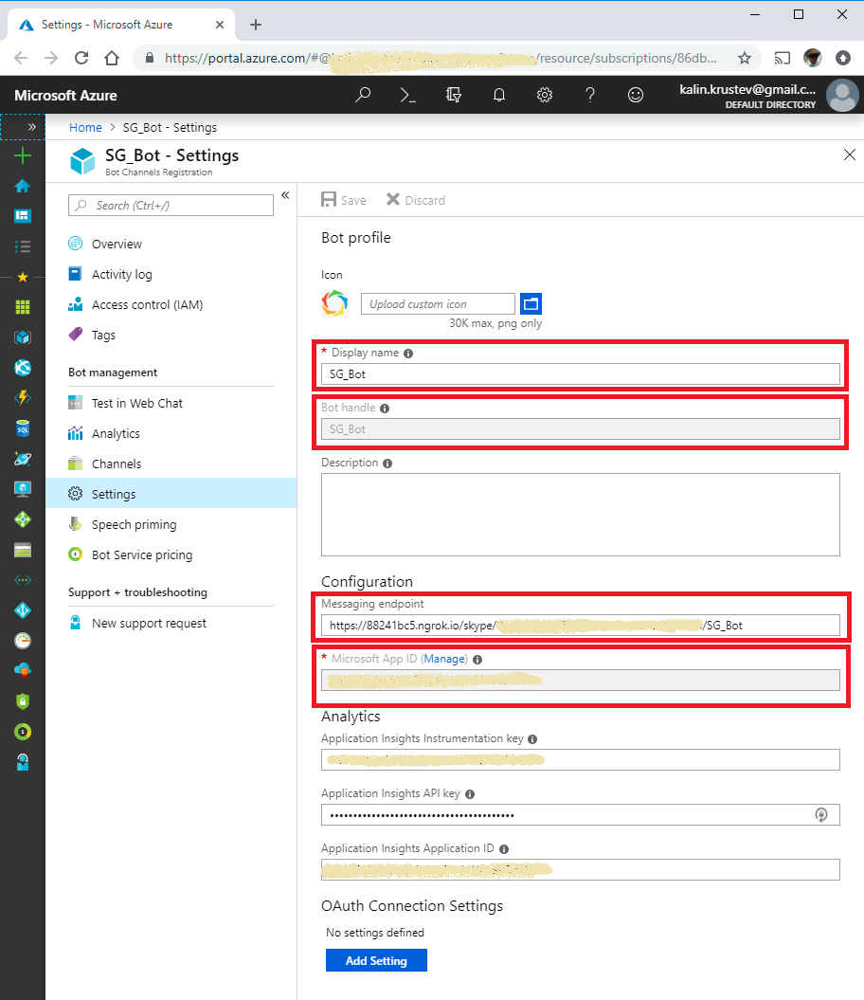
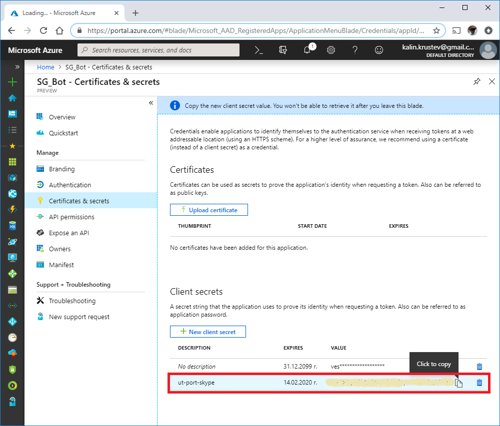
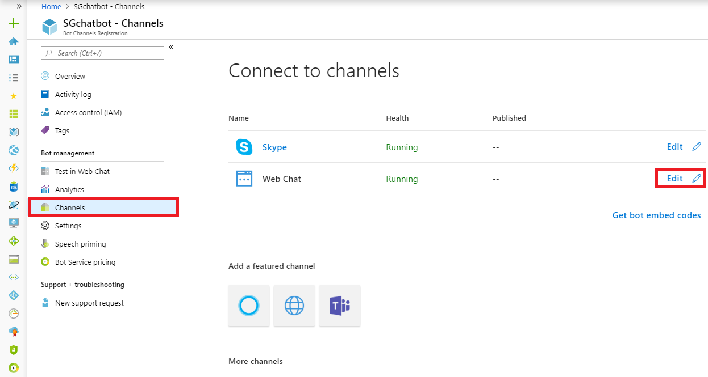
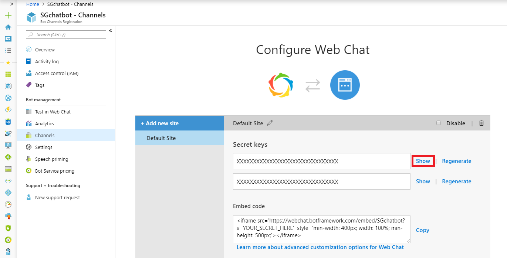

# ut-port-skype

## Properties

Use the screenshots below to define the following properties:

### Skype

* Bot properties
  * `appId` - use `Microsoft App Id`, highlighted in the screenshot below
  * `secret` - create a clien secret from `certificate & secrets`
    (click on `Manage` next to `Microsoft App Id`)
* Context properties
  * `clientId` - set to `skype/<Bot handle>`,
    where `<Bot handle>` is the value highlighted in the screenshot
  * `accessToken` - same value as in `secret` parameter
  * `name` - use `Display name (skype)`, where `Display name` is the string
    highlighted in the screenshot




### Webchat

* Bot properties - Use the same parameters as
  for [skype](###skype)
* Context properties
  * `clientId` - use `webchat/<Bot handle>`,
    where `<Bot handle>` is the value highlighted
    in the first screenshot above
  * `accessToken` - the first one of the secret keys pair
    (see the screenshots below)
  * `name` - use `Display name (webchat)`, where `Display name` is the string
    highlighted in the first screenshot above




#### Embedding the Web Chat

There are 3 approaches of embedding the Web Chat in an external page:

1) Put an iframe directly and place the Web Chat url as a source.

    Where the correct parameters should be set:
    * `{hostname}` - implementation hostname
    * `{appId}` - as described in the [skype](###skype) section
    * `{clientId}` - as described in the [webchat](###webchat) section

    ```html
    <html>
    <head></head>
    <body>
        <iframe src="https://{hostname}/webchat/{appId}/{clientId}"></iframe>
    </body>
    </html>
    ```

2) Use UT webchat script.
    Again set the correct `hostname`, `appId` and `clientId`
    as described for the first approach

    ```html
    <html>
    <head>
        <script src="https://{hostname}/webchat/{appId}/{clientId}/webchat.js"></script>
    </head>
    <body>
        ...
    </body>
    </html>
    ```

3) The third approach is mainly suitable for quick testing
  against an existing site. Simply create a bookmark and paste
  the following as URL. Again set the correct `hostname`, `appId`
  and `clientId` as described for the first approach

    ```js
    javascript:void((function(){var s = document.createElement('script');
    s.setAttribute('src', 'https://{hostname}/webchat/{appId}/{clientId}/webchat.js');
    document.body.appendChild(s);})())
    ```
